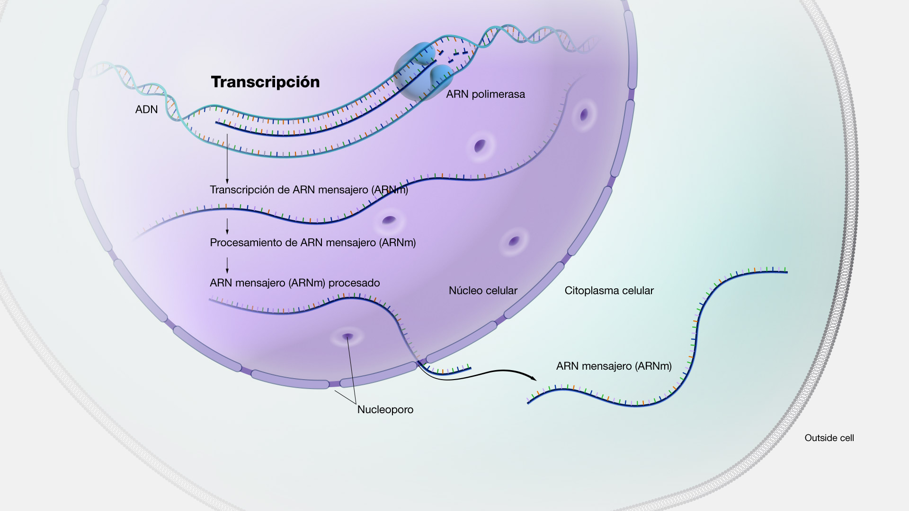
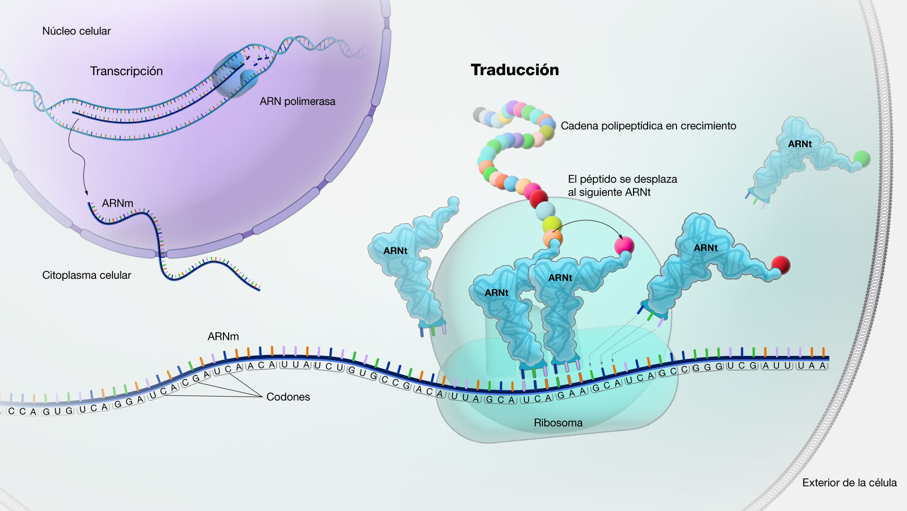

```{r, echo=FALSE, out.width="20%", fig.align = "right", fig.cap = '', warning=FALSE, message=FALSE}
knitr::include_graphics("Images/ubu.jpg")
```

# 1.- Introducción

Esta es una actividad complementaria, pero altamente recomendable a seguir ya que nos introduce en el mundo de la bioinformática con códigos muy sencillos y usando herramientas disponibles para el análisis de secuencias que nos facilitarán mucho la vida.

Comenzaremos con el trabajo sobre una secuencia "ficticia" de ADN, recordando de dónde provienen tenemos el siguiente esquema:

```{r, echo=FALSE, out.width="90%", fig.align = "center", fig.cap = 'Esquema transcripción', warning=FALSE, message=FALSE}
knitr::include_graphics("Images/Bioinformatica_Schema.png")
```

Por lo que lo primero que veremos cuando tengamos una lectura de ADN, será una secuencia nucleotídica del tipo:

```{r}
seq_dna <- c("ATGTCACCACAAACAGAGACT")
seq_dna
```

Vemos que nuestro ejemplo de cadena `seq_dna` no es más que un conjunto de letras. Dentro de R (y otros lenguajes de programación) a esto se le conoce como **character string** o **cadena de caracteres**. Para entender cómo lo está leyendo R, le pediremos que nos muestre su *estructura* usando la función `str()`.

```{r}
str(seq_dna)
```

Las tres letras señaladas **chr** hacen referencia a que es un *character*, es decir una cadena de caracteres que contienen los nucleótidos de nuestra secuencia.

Como primer ejercicio de programación, vamos a crear una función muy sencilla llamada `contar_nucleotidos()`, que nos permitirá, como dice su nombre, contar el número de cada uno de los nucleótidos que tenemos en nuestra secuencia:

```{r}
contar_nucleotidos <- function(secuencia_dna = seq_dna){
  conteo_nucleotidos = unlist(strsplit(x = secuencia_dna, split = "", fixed = TRUE))
  print(table(conteo_nucleotidos))
}
```

Cuando ejecutamos la caja de código superior vemos que nada sucede y esto es correcto, no vemos que suceda nada porque cuando creamos una función no estamos solicitando un resultado, solamente estamos creando una **receta** para trabajar con nuestros datos.

Tampoco importa si no entendemos al 100&% la función que estamos creando. Comentaros que el paso fundamental de la función es el uso de `unlist()` y de `strsplit()`.

Ahora sí, con nuestra función recién creada vamos a "*contar*" cuántos nucleótidos de cada tipo hay:

```{r}
contar_nucleotidos(secuencia_dna = seq_dna)
```
A continuación, revisaremos algunos de los pasos más fundamentales en *BioInformática* y para ello nos ayudaremos de funciones que ya existen (¡no tendremos que programarlas nosotros! ;P ).

# 2.- Cadena complementaria
Para poder generar una cadena complementaria de ADN, deberemos seguir las reglas de apareamiento de bases nitrógenedas, donde las correspondencias son *Adenina-Timina* (**`A-T`**) y *Citosina-Guanina* (**`C-G`**). Por lo tanto, cada vez que un nucleótido de nuestra cadena sea `A`, en la cadena complementaria correspondiente, el nucleótido que le tocaría sería el `T`. 

Podemos crear una función que realice esta acción a la que llamaremos `Complementaria()`. No es problema si no entiendes lo que sucede dentro de la función, pero es recomendable que intentes *mirar las tripas* de la función:
```{r}
Complementaria <- function(secuencia_dna = seq_dna){
  complementaria_adn = chartr("ATGC","TACG", secuencia_dna)
  complementaria_adn = paste(complementaria_adn, collapse = "")
  return(complementaria_adn)
}
```

Para ver si la función `Complementaria()` está haciendo lo que toca, imprimeremos ambas secuencias:
```{r}
seq_dna
Complementaria(seq_dna)
```

Ahora bien, para facilitarnos la vida, usaremos el paquete de R llamado `bioseq`, que como su nombre nos indica es *una caja de herramientas para manipular secuencias biológicas*. Para ver el paquete clicar [aquí](https://cran.r-project.org/web/packages/bioseq/index.html) y para la publicación del mismo, clicar [aquí](https://besjournals.onlinelibrary.wiley.com/doi/full/10.1111/2041-210X.13490).  

Para ello necesitaremos instalarlo (descargarlo desde la web) usando la función `install.packages()`, y una vez descargado, para poder usarlo debemos *activarlo*/*encenderlo*, con la función `library()`. 

```{r warning=FALSE, message=FALSE}
install.packages("bioseq")
library("bioseq")
```

Sin entrar en conceptos específicos de programación, lo primero que deberemos hacer será crear un objeto llamado `x_dna` que usando la función `dna()` y nuestra secuencia de nucleótidos (`seq_dna`), creará un objeto de clase `"bioseq_dna"`.

```{r}
# library(bioseq)
x_dna <- dna(seq_dna)
x_dna
```

Al imprimir el objeto `xdna` vemos que *luce diferente* y esta es una de las particularidades y ayudas que representa trabajar con paquetes específicos para trabajos bioinformáticos, en este caso.

Lo importante es que tenemos una sola secuencia y los nucleótidos se pintan de un color específico cada uno.

Si te interesa mirar y revisar en detalle la ayuda de este paquete la información la puedes encontrar [aquí](https://cran.r-project.org/web/packages/bioseq/vignettes/intro-bioseq.html).

Entonces, para poder crear la cadena complementaria vamos a usar la función `seq_complement()` a la que le pasamos nuestro objeto `x_dna`. Para una mejor comparación, vamos a imprimir en pantalla ambas secuencias:

```{r}
x_dna
seq_complement(x_dna)
```

Como podemos ver, hemos sido capaces de recrear la cadena complementaria y gracias al uso de funciones *ad-hoc* para este tipo de análisis el resultado luce bastante mejor, aunque en esencia es lo mismo que hemos creado a mano más arriba.  

# 3.- Transcripción
Cuando vamos de camino a generar una proteína, necesitamos sacar la información desde dentro del núcleo al exterior y para ello usamos el ARN mensajero `ARNm`. Es decir, necesitamos **transcribir** la información desde la cadena de ADN a una cadena de ARN. 


```{r, echo=FALSE, out.width="90%", fig.align = "center", fig.cap = 'Detalle del proceso de la transcripción', warning=FALSE, message=FALSE}

```

Como ya sabréis las correspondencias en este caso cambian y tenemos que la *Timina* es reemplazada por el *Uracilo*, por lo que las parejas ahora son **Adenina-Uracilo* (**`A-U`**) y *Citosina-Guanina* (**`C-G`**). 

En términos de programación, lo único que tenemos que hacer es repetir el paso de cambiar las letras, en este caso solo intercambiando la T por la U: 

```{r}
Transcripcion <- function(secuencia_dna = seq_dna){
  seq_arn = chartr("T","U", secuencia_dna)
  seq_arn = paste(seq_arn, collapse = "")
  return(seq_arn)
}
```

Para comprobar que nuestro código está funcionando, volveremos a imprimir la secuencia de ADN original (objeto `seq_dna`) y el resultante de aplicar nuestra función `Transcripcion()` sobre este ADN original:

```{r}
print(seq_dna)
Transcripcion(seq_dna)
```

Otra manera, más sencilla si se quiere, es el uso de la función `seq_transcribe()` del paquete `bioseq`. Fundamentalmente hace lo mismo que nuestra función, pero resaltando los resultados de una manera mucho más visual. En este caso el objeto que deberemos pasar es el objeto `x_dna` que posee la clase  `"bioseq_dna"`. Tal que:

```{r}
x_rna <- seq_transcribe(x_dna)
x_rna
```

Para evaluar los cambios imprimiremos en pantalla tanto el ADN como el ARN.

```{r}
x_dna
x_rna
```


# 4.- Traducir secuencias en aminoácidos
Estando ahora fuera del núcleo, la información transportada como `ARNm` es procesada por el ribosoma y el ARN d etransfeencia `ARNt` para generar una cadena de polipéptidos, que dará a lugar a un proteína que será funcional. Este poceso denominado *traducción* puede verse en el siguiente esquema:

```{r, echo=FALSE, out.width="90%", fig.align = "center", fig.cap = 'Esquema de la traducción', warning=FALSE, message=FALSE}

```
Los ribosomas y el `ARNt` solo pueden leer trozos o **codones** de `ARNm` que consisten en 3 aminoácidos. Estos tres aminoácidos son lueg convertidos a polipéptidos según la siguiente tabla de códigos genéticos

```{r, echo=FALSE, out.width="90%", fig.align = "center", fig.cap = 'Tabla de Aminoácidos según ARN', warning=FALSE, message=FALSE}
knitr::include_graphics("Images/Codigo-genetico_es_0.jpg")
```

Como ejemplo, usaremos la función `seq_translate()` del paquete `bioseq` para traducir una secuencia de ARNm en Proteínas.

```{r}
seq_translate(x_rna)
```

Veremos con solo un ejemplo más, que las funciones de este paquete `bioseq` nos permiten traducir a proteína pasándole directamente unas cadenas de AND, realizando internamente y sin que veamos el esultado, la transformación a ARNm y su traducción, tal que:
```{r}
x <- dna(c("ATGCAGA", "GGR","TTGCCTAGKTGAACC", "AGGNGC", "NNN"))
seq_translate(x)
```

### 4.1 Visualización de proteínas
Por último, revisaremos algunas heramientas para visualizar proteínas, ya que gracias a los nuevos algoritmos, procesadores y lenguajes de programación esta tarea resulta ahora mucho más sencilla.

La herramienta que revisaremos es un un **paquete** de R llamado "*NGLVieweR*" y su repositorio en github puede visitarse clicando [aquí](https://github.com/nvelden/NGLVieweR/).

```{r message=FALSE, warning=FALSE}
install.packages("NGLVieweR")
library("NGLVieweR")
```

Para visualizar las proteínas necesitamos su código del "**Protein Data Bank**" o "**Banco de datos de proteínas**", disponible en [https://www.rcsb.org/](https://www.rcsb.org/).

Buscaremos a modo de ejemplo la proteína **7CID**, catalogada como una estructura cristalina de *Pseudomonas aeruginosa* "**LpxC**" en complejo con inhibidor PAO1. Puede visitarse clicando [aquí](https://www.rcsb.org/structure/7CID).

```{r}
#Load protein by PDB code
NGLVieweR("7CID") %>%
addRepresentation("cartoon")
```

Este paquete también posee su propia aplicación **shiny** ("*shinyNGLVieweR*"), que se programa en su totalidad usando el lenguaje de programación R. El repositorio en GitHub de esta *APP* puede visitarse clicando [aquí](https://github.com/nvelden/shinyNGLVieweR); o bien para acceder e interactuar con la **APP Shiny**, deberemos acceder al siguiente [enlace](https://niels-van-der-velden.shinyapps.io/shinyNGLVieweR/).

#### Tarea (optativa)
Como **tarea** deberéis interactuar con la aplicación Shiny ("**shinyNGLVieweR**") y probar a cargar la estructura de la glicoproteína espiga (*spike*) del **SARS-CoV-2** , usando el código del PBD: **6VXX**. Puedes ver esta protéina directamente en la página del [Protein Data Bank ](https://www.rcsb.org/structure/6vxx).

En UbuVirtual en el entregable del curso, deberéis adjuntar imágenes de esta (u otra proteína) que hayáis explorado.

Acá os dejo una animación de la glicoproteína espiga que es una de las principales responsables en activar los síntomas conocidos como "*COVID-19*".

```{r message=TRUE, warning=FALSE, echo=FALSE}
NGLVieweR("6VXX") %>%
  stageParameters(backgroundColor = "white", zoomSpeed = 1) %>%
  addRepresentation("cartoon",
    param = list(name = "cartoon", colorScheme = "residueindex")
  ) %>%
  setSpin()
```
